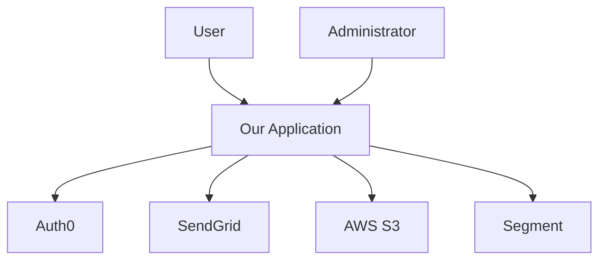
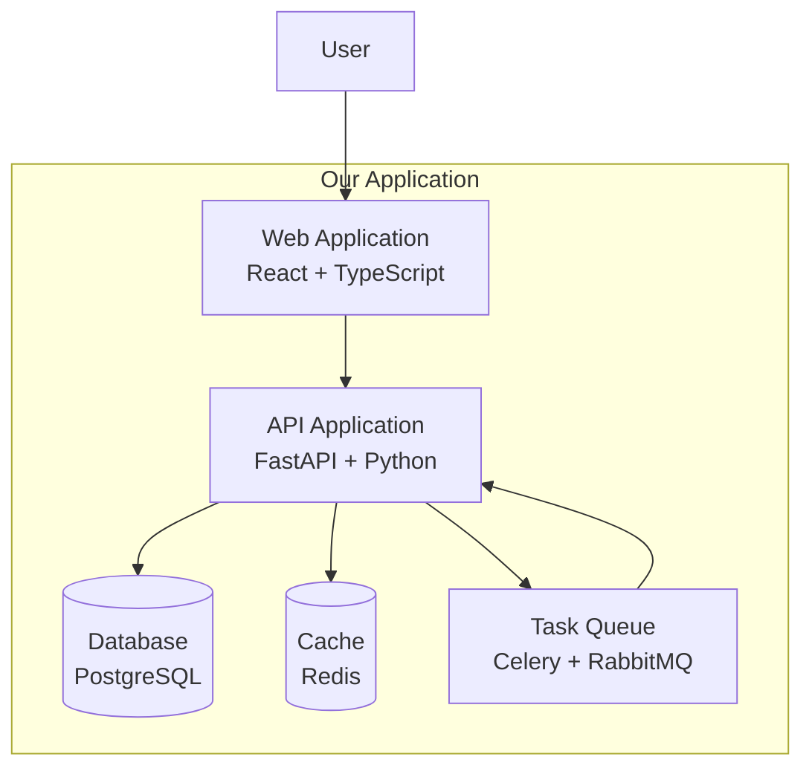
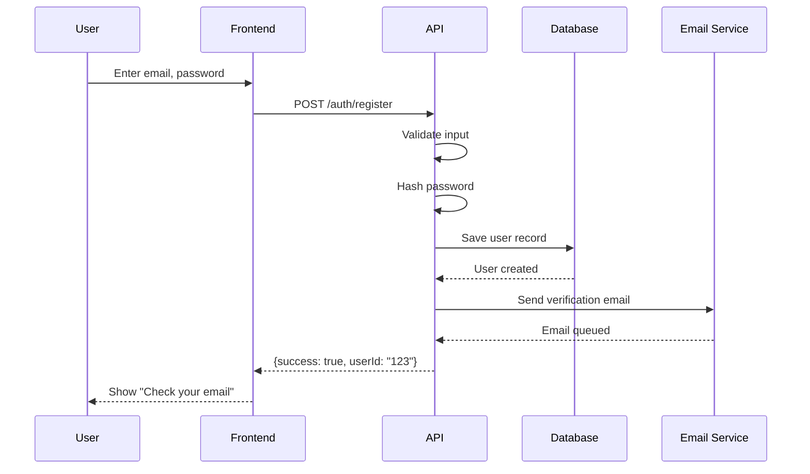
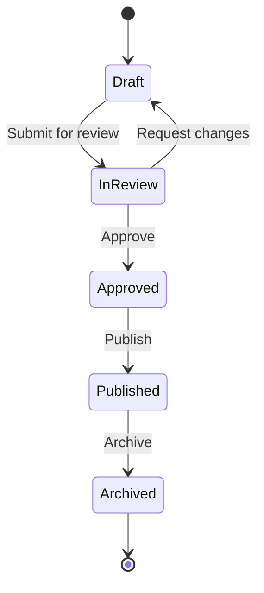
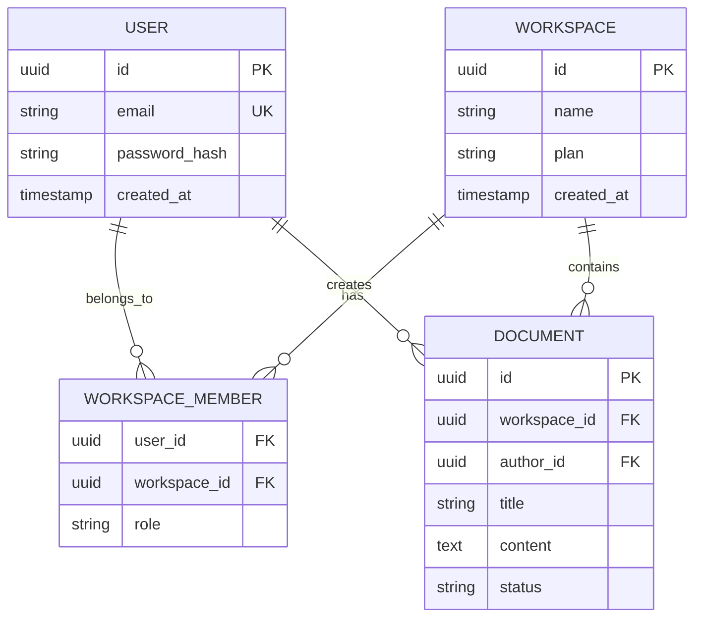

# Knowledge Management for AI-Assisted Development

> **When to apply:** All development projects, especially those with AI assistants
> **Maturity Level:** All levels (increases in sophistication with maturity)

Capture, organize, and transfer knowledge effectively to maximize productivity with AI assistants and enable seamless team collaboration.

## Table of Contents

- [Overview](#overview)
- [Knowledge Capture](#knowledge-capture)
- [Context Organization](#context-organization)
- [Visual Scaffolding](#visual-scaffolding)
- [Documentation Strategies](#documentation-strategies)
- [Team Knowledge Sharing](#team-knowledge-sharing)
- [AI Context Management](#ai-context-management)

---

## Overview

### The Knowledge Challenge

**Problems AI assists solve:**
- Ramping up new team members
- Understanding legacy codebases
- Maintaining context across sessions
- Documenting decisions and patterns
- Sharing knowledge across distributed teams

**Problems AI introduces:**
- Over-reliance on AI without capturing institutional knowledge
- Context loss between AI sessions
- Difficulty transferring AI-assisted work to humans
- Risk of losing implicit knowledge

### Knowledge Management Principles

1. **Capture Early, Refine Later** - Document while fresh
2. **Context Over Completeness** - Provide enough context to understand "why"
3. **Visual Where Possible** - Diagrams beat paragraphs
4. **Discoverable** - Easy to find when needed
5. **Versioned** - Track knowledge evolution

---

## Knowledge Capture

### What to Capture

**Architecture Decisions (ADRs):**

```markdown
# ADR-001: Use PostgreSQL for Primary Database

## Status
Accepted - 2025-12-13

## Context
We need to choose a database for our user management system. Requirements:
- ACID transactions for user data integrity
- Complex queries for reporting
- Team familiarity
- < 100ms query latency for 10M users

## Decision
Use PostgreSQL 16 as primary database.

## Consequences
Positive:
- Strong ACID guarantees
- Excellent query performance
- JSON support for flexible schemas
- Team has PostgreSQL experience
- Free and open source

Negative:
- Requires vertical scaling for very large datasets
- More complex than NoSQL for simple KV lookups
- Need to manage backups and replication

## Alternatives Considered
- MongoDB: Rejected (need transactions, complex queries)
- DynamoDB: Rejected (team unfamiliarity, vendor lock-in)
- MySQL: Viable alternative, chose PostgreSQL for JSON support
```

**Design Decisions:**

```python
# design-decisions.md

## Why We Use Dependency Injection

**Context:** Managing database connections, external services, and testability.

**Decision:** Use dependency injection pattern throughout the application.

**Example:**
```python
# ❌ BAD: Hard-coded dependencies
class UserService:
    def __init__(self):
        self.db = PostgreSQL("prod-db-url")  # Can't test!
        self.email = SendGridClient()        # Can't mock!

# ✅ GOOD: Injected dependencies
class UserService:
    def __init__(self, database: Database, email_client: EmailClient):
        self.db = database       # Injected, testable
        self.email = email_client  # Injected, mockable
```

**Benefits:**
- Testable: Inject mocks in tests
- Flexible: Swap implementations easily
- Clear: Dependencies explicit in constructor
```

### When to Capture

**Immediately After:**
- Making architectural decisions
- Solving difficult bugs
- Discovering non-obvious patterns
- Learning something surprising
- Choosing between alternatives

**During:**
- Code reviews (capture rationale)
- Pair programming sessions
- Incident post-mortems
- Design discussions

---

## Context Organization

### Repository Structure

```
/
├── .context/                 # AI assistant context
│   ├── README.md            # Project overview for AI
│   ├── codebase-map.md      # High-level structure
│   ├── getting-started.md   # Setup and first steps
│   └── conventions.md       # Coding patterns
│
├── docs/
│   ├── architecture/
│   │   ├── overview.md
│   │   ├── adr/            # Architecture Decision Records
│   │   └── diagrams/
│   ├── design/
│   │   ├── database-schema.md
│   │   ├── api-design.md
│   │   └── patterns.md
│   ├── operations/
│   │   ├── deployment.md
│   │   ├── runbooks/
│   │   └── monitoring.md
│   └── onboarding/
│       ├── new-developer.md
│       └── common-tasks.md
│
└── README.md                # Start here
```

### The `.context/` Directory

**Purpose:** Provide AI assistants with essential project context.

**`.context/README.md` Template:**

```markdown
# Project Context for AI Assistants

## What This Project Does
[One-paragraph elevator pitch]

## Architecture Overview
- **Frontend:** React + TypeScript (src/frontend/)
- **Backend:** FastAPI + Python (src/backend/)
- **Database:** PostgreSQL 16
- **Cache:** Redis
- **Deployment:** AWS (ECS Fargate)

## Key Concepts
- **User:** Person using the application
- **Workspace:** Shared environment for teams
- **Document:** Primary content type

## Code Organization
```
src/
├── frontend/         # React SPA
│   ├── components/  # Reusable UI components
│   ├── pages/       # Route-level components
│   └── hooks/       # Custom React hooks
├── backend/
│   ├── api/         # FastAPI routes
│   ├── models/      # SQLAlchemy models
│   ├── services/    # Business logic
│   └── utils/       # Helpers
└── shared/          # Shared types/constants
```

## Coding Conventions
- Use Zod for runtime validation
- Prefer composition over inheritance
- All API endpoints return `{data, error}` shape
- Use React Query for data fetching
- Database migrations in `migrations/` (Alembic)

## Common Tasks
- Run tests: `npm test` (frontend), `pytest` (backend)
- Start dev server: `npm run dev`
- Database migration: `alembic upgrade head`
- Deploy to staging: `npm run deploy:staging`

## Important Constraints
- All user data must be encrypted at rest
- API responses < 200ms (p95)
- Support IE11 (legacy customer requirement)
- GDPR compliance required

## Where to Find Things
- Authentication: `src/backend/services/auth.py`
- Billing logic: `src/backend/services/billing.py`
- Email templates: `src/backend/templates/emails/`
- API documentation: `docs/api/openapi.yaml`
```

---

## Visual Scaffolding

### Architecture Diagrams

**System Context Diagram (C4 Model - Level 1):**

```markdown
## System Context



**Container Diagram (C4 Model - Level 2):**



### Data Flow Diagrams

```markdown
## User Registration Flow



### State Machines

```markdown
## Document Workflow States



### Entity Relationship Diagrams

```markdown
## Database Schema (Core Tables)



---

## Documentation Strategies

### Progressive Documentation

**Level 1: README (5 minutes to understand)**
- What does this do?
- How do I run it?
- How do I deploy it?

**Level 2: Architecture Docs (30 minutes to understand)**
- How is this structured?
- What are the key components?
- How do they interact?

**Level 3: Deep Dives (2 hours to understand)**
- How does feature X work?
- Why did we choose technology Y?
- How do I extend/modify Z?

### Living Documentation

**Code as Documentation:**

```python
from typing import Protocol
from dataclasses import dataclass

class PaymentProcessor(Protocol):
    """
    Payment processing interface.

    All payment providers must implement this interface.
    Used for: Stripe, PayPal, manual bank transfers.

    See: docs/billing/payment-processing.md
    """

    def charge(self, amount: Money, source: PaymentSource) -> PaymentResult:
        """
        Charge a payment source.

        Args:
            amount: Amount to charge (must be positive)
            source: Payment source (card, bank account, etc.)

        Returns:
            PaymentResult with transaction ID if successful

        Raises:
            PaymentDeclined: If payment is declined
            InsufficientFunds: If insufficient funds
            InvalidPaymentSource: If source is invalid

        Example:
            ```python
            result = processor.charge(
                amount=Money(10.00, "USD"),
                source=saved_card
            )
            if result.success:
                print(f"Charged {result.transaction_id}")
            ```
        """
        ...

@dataclass
class Money:
    """
    Represents a monetary amount with currency.

    Always use this type instead of raw floats to avoid:
    - Currency mismatch errors
    - Floating point precision issues
    - Implicit currency assumptions
    """
    amount: Decimal
    currency: str  # ISO 4217 code (USD, EUR, GBP, etc.)

    def __post_init__(self):
        if self.amount < 0:
            raise ValueError("Money amount must be non-negative")
        if self.currency not in SUPPORTED_CURRENCIES:
            raise ValueError(f"Unsupported currency: {self.currency}")
```

### Decision Logs

**Track Key Decisions:**

```markdown
# Decision Log

## 2025-12-13: Migrate to TypeScript
**Context:** Growing codebase, frequent type-related bugs
**Decision:** Migrate JavaScript codebase to TypeScript over 3 months
**Impact:** +2 weeks setup, -30% runtime errors (estimated)
**Status:** In Progress (25% complete)

## 2025-12-10: Switch from REST to GraphQL
**Context:** Mobile app making 10+ API calls per screen
**Decision:** Deferred - REST is working, GraphQL adds complexity
**Rationale:** Not worth the migration cost for current scale
**Revisit:** When mobile team grows to 3+ developers

## 2025-12-01: Use Zod for Validation
**Context:** Need runtime validation for API requests
**Decision:** Adopt Zod library for all validation
**Impact:** Type-safe validation, auto-generated types
**Status:** Rolled out to 100% of API endpoints
```

---

## Team Knowledge Sharing

### Knowledge Transfer Strategies

**Pair Programming:**
- Junior + AI: AI explains, junior learns
- Senior + AI: Senior guides AI, documents decisions
- Peer + Peer: Share AI-assisted workflows

**Code Reviews as Teaching:**

```markdown
## Code Review Comment Example

```diff
- if user.role == "admin" or user.role == "owner":
+ if user.has_permission("manage_workspace"):
```

**Why this change:**
This makes the code more maintainable as we add more roles. We're moving toward permission-based access control rather than role-based.

**Context:**
See ADR-005: Permission System Design
Related: `src/auth/permissions.py`

**Learning Resource:**
- RBAC vs ABAC: https://...
```

### Weekly Knowledge Sharing

```markdown
# Friday Knowledge Share (30 min)

## This Week I Learned (TWIL)

**Sarah:** How to use React Query for optimistic updates
- Challenge: User clicks "like", expects instant feedback
- Solution: Optimistic update with rollback
- Code: src/components/LikeButton.tsx
- Docs: docs/frontend/optimistic-updates.md

**Mike:** PostgreSQL query optimization with EXPLAIN
- Problem: Dashboard loading in 8 seconds
- Root cause: Missing index on `created_at`
- Solution: Added index, now 200ms
- Learning: Always EXPLAIN ANALYZE slow queries

**AI Learning:** How to use Claude to refactor legacy code
- Technique: Break large file into focused prompts
- Key insight: Provide tests first, let AI refactor
- Pattern works for: Extract function, move logic, rename
```

---

## AI Context Management

### Session Context Files

**Create context file before AI session:**

```markdown
# Session Context: Add User Export Feature

## Goal
Allow admins to export all workspace users as CSV.

## Current State
- User list exists: `src/components/UserList.tsx`
- Backend has user query: `src/api/users.py#get_workspace_users`
- No export functionality yet

## Requirements
- Export button in user list UI
- Generate CSV with columns: name, email, role, joined_date
- Limit to admin/owner roles
- Include last 90 days of users (GDPR compliance)
- File naming: `workspace-{name}-users-{date}.csv`

## Technical Constraints
- Use Papaparse library for CSV generation (already installed)
- Reuse existing `GET /workspaces/{id}/users` endpoint
- Add `format=csv` query parameter for CSV response
- Frontend: Download file client-side (no server storage)

## Files to Modify
- `src/components/UserList.tsx` - Add export button
- `src/api/users.py` - Add CSV response format
- `src/utils/export.py` - CSV generation helper (new file)

## Related Code
See similar feature: Export invoices (`src/components/BillingHistory.tsx`)

## Tests to Add
- `tests/api/test_user_export.py` - CSV generation
- `tests/frontend/UserList.test.tsx` - Export button behavior
```

### Prompt Templates

**Bug Fix Template:**

```markdown
I need help fixing a bug:

**Bug Description:** Users can't upload files > 10MB

**Steps to Reproduce:**
1. Go to document page
2. Click upload
3. Select 15MB PDF
4. Upload fails with 413 error

**Expected:** File uploads successfully (we support up to 50MB)

**Actual:** Request fails before reaching backend

**Relevant Code:** src/api/client.ts (API configuration)

**Recent Changes:** None to upload code

**Error Message:**
```
Error: Request failed with status code 413
```

**Context:**
- We use Axios for API calls
- Backend accepts 50MB (verified with curl)
- Worked yesterday, broken today

Please help diagnose and fix.
```

**Feature Template:**

```markdown
I want to add a new feature:

**Feature:** Real-time notifications

**User Story:** As a user, I want to see notifications immediately when someone mentions me, so I can respond quickly.

**Acceptance Criteria:**
- [ ] User receives notification within 5 seconds of mention
- [ ] Notification shows in UI without refresh
- [ ] Notification includes message preview and link
- [ ] Works across browser tabs
- [ ] No notifications when user is offline

**Technical Approach:** (leave blank for AI to suggest, or specify)

**Similar Features:** See message indicators (`src/components/MessageNotification.tsx`)

**Constraints:**
- Must scale to 10k concurrent users
- Use WebSockets (already configured)
- Mobile support not required yet

Please suggest implementation approach.
```

### Context Preservation

**Between Sessions:**

```markdown
# Session Notes: 2025-12-13

## What We Did
- Implemented user export feature
- Added CSV generation with Papaparse
- Created tests (5 passing)
- Pending: Frontend download button

## Decisions Made
- Use client-side CSV generation (avoid server storage)
- Include only last 90 days (GDPR compliance)
- Reuse existing user query endpoint

## Next Steps
- Add export button to UserList component
- Wire up API call with `format=csv` parameter
- Test with large workspaces (1000+ users)
- Update documentation

## Issues Encountered
- Papaparse types missing, added @types/papaparse
- CSV header formatting unclear, settled on snake_case

## Files Modified
- src/api/users.py
- src/utils/export.py (new)
- tests/api/test_user_export.py (new)

## Commit
SHA: abc123
Message: "Add backend CSV export for users"
```

---

## Related Resources

- See `base/ai-assisted-development.md` for AI workflow patterns
- See `base/parallel-development.md` for team coordination
- See `base/specification-driven-development.md` for requirements documentation
- See `base/testing-philosophy.md` for test documentation

---

**Remember:** Knowledge management is not overhead—it's an investment. The time spent documenting today saves hours of confusion tomorrow and enables effective collaboration with both AI assistants and human teammates.
