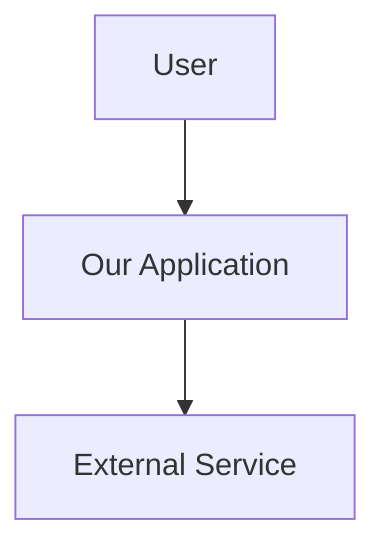
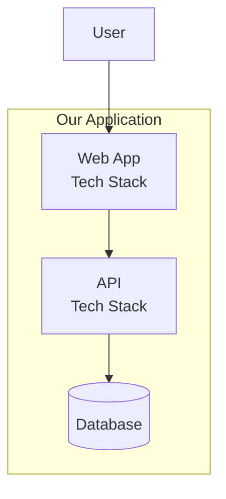
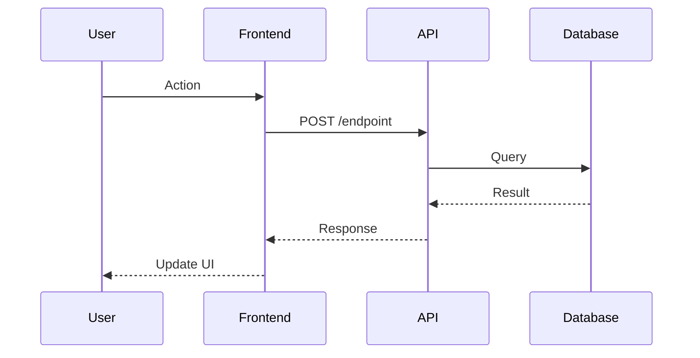
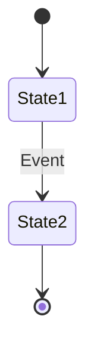
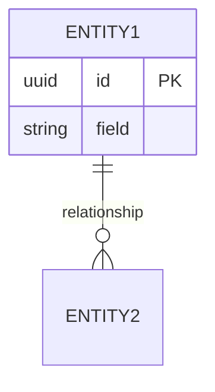

# Knowledge Management for AI-Assisted Development

> **When to apply:** All development projects, especially those with AI assistants
> **Maturity Level:** All levels

Capture, organize, and transfer knowledge effectively to maximize productivity with AI assistants and enable seamless team collaboration.

## Table of Contents

- [Knowledge Capture](#knowledge-capture)
- [Context Organization](#context-organization)
- [Visual Scaffolding](#visual-scaffolding)
- [Documentation Strategies](#documentation-strategies)
- [AI Context Management](#ai-context-management)

---

## Knowledge Capture

### What and When to Capture

| What | When | Format |
|------|------|--------|
| **Architecture Decisions** | After choosing technologies, patterns, or approaches | ADR (Status, Context, Decision, Consequences, Alternatives) |
| **Design Decisions** | When implementing patterns or solving technical problems | Design doc with examples (Bad vs Good code) |
| **Bug Solutions** | After solving difficult bugs | Issue comment or doc with root cause |
| **Learning** | When discovering non-obvious patterns | Short note in team wiki |
| **Trade-offs** | During code reviews, design discussions | Decision log entry |

### ADR Template

```markdown
# ADR-001: [Decision Title]

## Status
[Accepted|Rejected|Deprecated] - YYYY-MM-DD

## Context
[Problem, requirements, constraints]

## Decision
[What we decided]

## Consequences
**Positive:** [Benefits]
**Negative:** [Trade-offs]

## Alternatives Considered
[What we rejected and why]
```

### Design Decision Template

```markdown
## [Pattern Name]

**Context:** [Problem being solved]

**Decision:** [Pattern/approach chosen]

**Example:**
```python
# ❌ BAD: [Anti-pattern]
[code]

# ✅ GOOD: [Preferred pattern]
[code]
```

**Benefits:** [Why this is better]
```

---

## Context Organization

### Repository Structure

```
/
├── .context/                 # AI assistant context
│   ├── README.md            # Project overview for AI
│   ├── codebase-map.md      # High-level structure
│   └── conventions.md       # Coding patterns
│
├── docs/
│   ├── architecture/
│   │   ├── overview.md
│   │   ├── adr/            # Architecture Decision Records
│   │   └── diagrams/
│   ├── design/
│   │   ├── database-schema.md
│   │   └── patterns.md
│   ├── operations/
│   │   ├── deployment.md
│   │   └── runbooks/
│   └── onboarding/
│       └── new-developer.md
│
└── README.md                # Start here
```

### .context/README.md Template

```markdown
# Project Context for AI Assistants

## What This Project Does
[One-paragraph elevator pitch]

## Architecture Overview
- **Frontend:** [Tech stack + location]
- **Backend:** [Tech stack + location]
- **Database:** [DB + version]
- **Cache/Queue:** [If applicable]
- **Deployment:** [Platform]

## Key Concepts
- **[Concept]:** [Brief definition]

## Code Organization
```
src/
├── [directory]/    # [Purpose]
└── [directory]/    # [Purpose]
```

## Coding Conventions
- [Convention 1]
- [Convention 2]

## Common Tasks
- Run tests: `[command]`
- Start dev: `[command]`
- Deploy: `[command]`

## Important Constraints
- [Critical constraint 1]
- [Critical constraint 2]

## Where to Find Things
- [Feature]: `[file path]`
```

---

## Visual Scaffolding

### C4 Architecture Diagrams

**Level 1 - System Context:**


**Level 2 - Container:**


### Flow Diagrams

**Sequence Diagram:**


**State Machine:**


**ERD:**


---

## Documentation Strategies

### Progressive Documentation Levels

| Level | Time to Understand | Content | Location |
|-------|-------------------|---------|----------|
| **1: Quick Start** | 5 minutes | What it does, how to run, how to deploy | README.md |
| **2: Architecture** | 30 minutes | Structure, components, interactions | docs/architecture/ |
| **3: Deep Dives** | 2 hours | Feature details, technology choices, extensions | docs/design/ |

### Living Documentation

**Self-Documenting Code:**
```python
from typing import Protocol
from dataclasses import dataclass

class PaymentProcessor(Protocol):
    """Payment processing interface.

    All payment providers must implement this interface.
    See: docs/billing/payment-processing.md
    """

    def charge(self, amount: Money, source: PaymentSource) -> PaymentResult:
        """Charge a payment source.

        Args:
            amount: Amount to charge (must be positive)
            source: Payment source (card, bank account, etc.)

        Returns:
            PaymentResult with transaction ID if successful

        Raises:
            PaymentDeclined: If payment is declined
            InvalidPaymentSource: If source is invalid
        """
        ...

@dataclass
class Money:
    """Monetary amount with currency.

    Use this instead of raw floats to avoid currency mismatch
    and precision issues.
    """
    amount: Decimal
    currency: str  # ISO 4217 code (USD, EUR, etc.)
```

### Decision Log Template

```markdown
# Decision Log

## YYYY-MM-DD: [Decision Title]
**Context:** [Why this came up]
**Decision:** [What we decided]
**Impact:** [Cost/benefit]
**Status:** [In Progress|Complete|Deferred]
**Revisit:** [When to reconsider, if applicable]
```

---

## AI Context Management

### Session Context Template

Create before AI session:

```markdown
# Session Context: [Feature/Fix Name]

## Goal
[One sentence objective]

## Current State
- [Existing relevant code/files]
- [What doesn't exist yet]

## Requirements
- [Requirement 1]
- [Requirement 2]

## Technical Constraints
- [Constraint 1]
- [Constraint 2]

## Files to Modify
- `[path]` - [What to change]

## Related Code
[Similar features to reference]

## Tests to Add
- `[path]` - [What to test]
```

### Bug Fix Prompt Template

```markdown
**Bug:** [One-line description]

**Steps to Reproduce:**
1. [Step 1]
2. [Step 2]

**Expected:** [What should happen]
**Actual:** [What happens]

**Error:**
```
[Error message]
```

**Relevant Code:** [File paths]
**Recent Changes:** [What changed recently]
**Context:** [Additional info]
```

### Feature Request Prompt Template

```markdown
**Feature:** [Name]

**User Story:** As a [role], I want [goal], so [benefit].

**Acceptance Criteria:**
- [ ] [Criterion 1]
- [ ] [Criterion 2]

**Similar Features:** [Reference existing code]

**Constraints:**
- [Constraint 1]
- [Constraint 2]

**Technical Approach:** [Optional - let AI suggest or specify]
```

### Session Notes Template

Capture after AI session:

```markdown
# Session Notes: YYYY-MM-DD

## Completed
- [What was implemented]

## Decisions
- [Decision 1 with rationale]

## Next Steps
- [ ] [Task 1]
- [ ] [Task 2]

## Issues Encountered
- [Issue and resolution]

## Files Modified
- [path] (new|modified)

## Commit
SHA: [hash]
Message: "[message]"
```

### Knowledge Transfer Strategies

| Strategy | Format | When |
|----------|--------|------|
| **Pair Programming** | Junior + AI, Senior + AI, Peer + Peer | Active development |
| **Code Review Comments** | Explain why + context + learning resources | All PRs |
| **Weekly Knowledge Share** | 30-min TWIL (This Week I Learned) | Every Friday |
| **Session Notes** | Structured notes after AI sessions | End of each session |

### Code Review Teaching Template

```markdown
```diff
- [old code]
+ [new code]
```

**Why:** [Explanation]
**Context:** [ADR/doc reference]
**Learning:** [Resource link]
```

---

## Related Resources

- `base/ai-assisted-development.md` - AI workflow patterns
- `base/parallel-development.md` - Team coordination
- `base/specification-driven-development.md` - Requirements documentation
- `base/testing-philosophy.md` - Test documentation

---

**Remember:** Knowledge management is an investment. Time spent documenting today saves hours tomorrow and enables effective AI and human collaboration.
